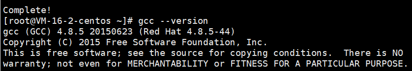
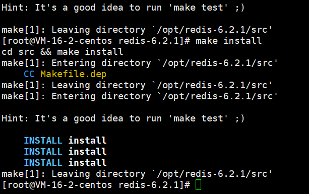

# redis安装

## 第一步gcc

安装C 语言的编译环境

yum install gcc

测试 gcc版本 

yum --version

## 第二步

下载redis-6.2.1.tar.gz放/opt目录

tar -zxvf redis-6.2.1.tar.gz

解压完成后进入目录：cd redis-6.2.1

在redis-6.2.1目录下再次执行make命令（只是编译好）

成功后：

成功后查看默认安装目录： /usr/local/bin 

redis-benchmark:性能测试工具，可以在自己本子运行，看看自己本子性能如何
redis-check-aof：修复有问题的AOF文件，rdb和aof后面讲
redis-check-dump：修复有问题的dump.rdb文件
redis-sentinel：Redis集群使用
redis-server：Redis服务器启动命令
redis-cli：客户端，操作入口

## 修改配置文件

把redis.conf复习到/myredis下

修改

1. 后台启动设置daemonize no改成yes(支持后台启动)

2. 注视bind=127.0.0.1（变成所有人都能连，也能加ip地址）
3. protected-mode 将本机访问保护模式设置no
4. requirepass xxx(设置密码)

# 使用

## 第一种：redis-cli 

启动服务：redis-server /myredis/redis.conf

查看 ： ps -ef|grep redis

客户端连接（一定要先启动服务）：

1.  redis-cli -a xxx(xxx是密码)
2. 先redis-cli 再AUTH xxx

关闭：

1. 查看进程号后用: kill -9 进程号
2. redis-cli -a xxx shutdown（xxx是密码）

## 第二种（RDM）

打开端口：

`vi /etc/sysconfig/iptables`

加入防火墙规则：

`-A INPUT -m state –state NEW -m tcp -p tcp –dport 6379 -j ACCEPT`

重启防火墙：

`service iptables status`

查看端口是否开放：

netstat -aptn  

如果在某云服务器，注意增加安全组策略

附上几条防火墙命令：

service iptables status # 查看iptables状态
service iptables restart # iptables服务重启
service iptables stop  # iptables服务禁用

# windows安装配置

windows下载:`redis-server.exe redis.windows.conf`

修改配置文件在`redis.windows.conf`

下载地址：https://github.com/tporadowski/redis/releases

# Redis在项目中的使用场景

| 数据类型 | 使用场景                                                     |
| -------- | ------------------------------------------------------------ |
| String   | 比如说 ，我想知道什么时候封锁一个IP地址。Incrby命令          |
| Hash     | 存储用户信息【id，name，age】Hset(key,field,value)Hset(userKey,id,101)Hset(userKey,name,admin)Hset(userKey,age,23)----修改案例----Hget(userKey,id)Hset(userKey,id,102)为什么不使用String 类型来存储Set(userKey,用信息的字符串)Get(userKey)不建议使用String 类型 |
| List     | 实现最新消息的排行，还可以利用List的push命令，将任务存在list集合中，同时使用另一个命令，将任务从集合中取出[pop]。Redis—list数据类型来模拟消息队列。【电商中的秒杀就可以采用这种方式来完成一个秒杀活动】 |
| Set      | 特殊之处：可以自动排重。比如说微博中将每个人的好友存在集合(Set)中，这样求两个人的共通好友的操作。我们只需要求交集即可。 |
| Zset     | 以某一个条件为权重，进行排序。京东：商品详情的时候，都会有一个综合排名，还可以按照价格进行排名。 |

